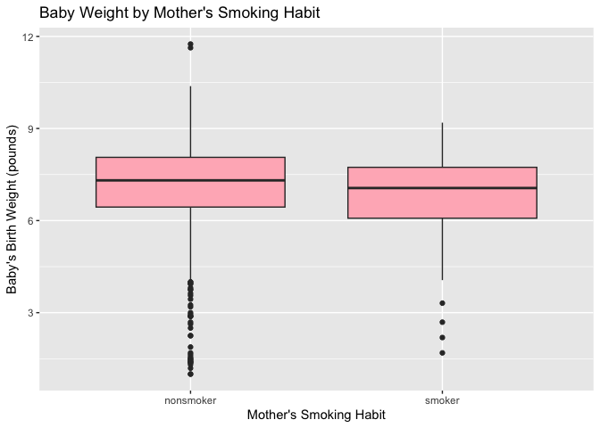
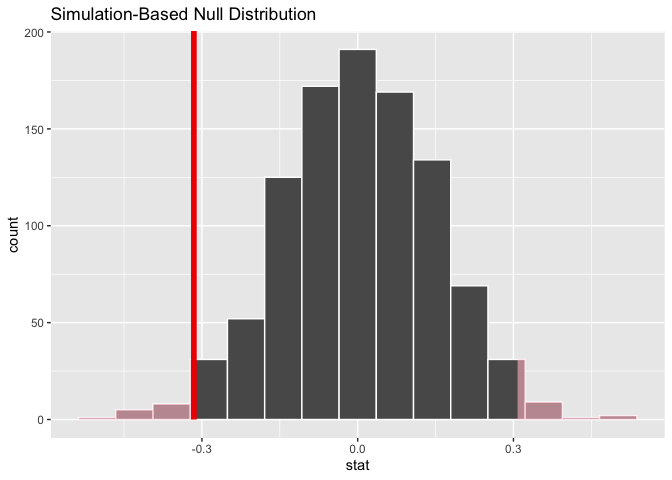
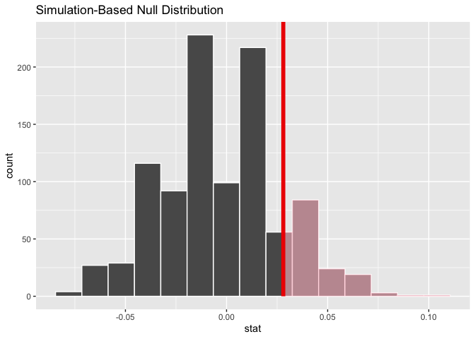

Lab 11 - Smoking during pregnancy
================
Zi Li
3/26

### Load packages and data

``` r
library(tidyverse) 
library(tidymodels)
library(openintro)

data(ncbirths)

nrow(ncbirths)
```

    ## [1] 1000

``` r
# we got 1000 cases in the dataset. 
```

### Exercise-Baby weights

``` r
# H0:μ = 7.43 pounds
# H1:μ /= 7.43 pounds

ncbirths_white <- ncbirths %>% filter(whitemom == "white")
mean(ncbirths_white$weight, na.rm = TRUE)
```

    ## [1] 7.250462

``` r
# Are the criteria necessary for conducting simulation-based inference satisfied? Explain your reasoning.
# I looked up the simulation-based inference online, and yes, I think it's satisfied. 
# it's a random sample, the sample size is ok, and each case is independent to others. nice :)


mean_weight <- ncbirths_white %>%
  specify(response = weight) %>%
  calculate(stat = "mean")
mean_weight
```

    ## Response: weight (numeric)
    ## # A tibble: 1 × 1
    ##    stat
    ##   <dbl>
    ## 1  7.25

``` r
# 7.25, lower than 7.43 (the average weight of White babies born in the US at 1995)

set.seed(42) # I didn't know what number to put in the parentheses so I looked it up, and I found what I thought was a very romantic answer 
# People online say it can be any number, but in the Hitchhiker's Guide to the Galaxy, 42 is “the answer to life, the universe, and everything,” so I'm just gonna go with 42.

null_dist <- ncbirths_white %>%
  specify(response = weight) %>%
  hypothesize(null = "point", mu = 7.43) %>%
  generate(reps = 1000, type = "bootstrap") %>%
  calculate(stat = "mean")

obs_mean <- ncbirths_white %>%
  specify(response = weight) %>%
  calculate(stat = "mean")

get_p_value(null_dist, obs_stat = obs_mean$stat, direction = "two-sided")
```

    ## # A tibble: 1 × 1
    ##   p_value
    ##     <dbl>
    ## 1   0.002

``` r
visualize(null_dist) +
  shade_p_value(obs_stat = obs_mean$stat, direction = "two-sided")
```

<!-- -->

``` r
# P<0.002; reject the null, the average baby weight has changed since 1995.
```

### Exercise 2- Baby weight Vs. smoking

``` r
ncbirths_clean <- ncbirths %>%
  filter(!is.na(habit), !is.na(weight))

ggplot(ncbirths_clean, aes(x = habit, y = weight)) +
  geom_boxplot(fill = "lightpink") +
  labs(title = "Baby Weight by Mother's Smoking Habit",
       x = "Mother's Smoking Habit",
       y = "Baby's Birth Weight (pounds)")
```

<!-- -->

``` r
ncbirths_clean %>%
  group_by(habit) %>%
  summarize(mean_weight = mean(weight)) #nonsmoker:7.14; smoker: 6.83. 
```

    ## # A tibble: 2 × 2
    ##   habit     mean_weight
    ##   <fct>           <dbl>
    ## 1 nonsmoker        7.14
    ## 2 smoker           6.83

``` r
# H₀: μ₁ = μ₂ (No difference in baby weights between smokers and non-smokers)
# H₁: μ₁ ≠ μ₂ (There is a difference)

obs_diff <- ncbirths_clean %>%
  specify(response = weight, explanatory = habit) %>%
  calculate(stat = "diff in means", order = c("smoker", "nonsmoker"))

null_dist <- ncbirths_clean %>%
  specify(response = weight, explanatory = habit) %>%
  hypothesize(null = "independence") %>%
  generate(reps = 1000, type = "permute") %>%
  calculate(stat = "diff in means", order = c("smoker", "nonsmoker"))

visualize(null_dist) +
  shade_p_value(obs_stat = obs_diff, direction = "two-sided")
```

<!-- -->

``` r
get_p_value(null_dist, obs_stat = obs_diff, direction = "two-sided") # p=0.024
```

    ## # A tibble: 1 × 1
    ##   p_value
    ##     <dbl>
    ## 1    0.03

``` r
ncbirths_clean %>%
  specify(response = weight, explanatory = habit) %>%
  generate(reps = 1000, type = "bootstrap") %>%
  calculate(stat = "diff in means", order = c("smoker", "nonsmoker")) %>%
  get_confidence_interval(level = 0.95, type = "percentile") # CI: -0.598, -0.062. 
```

    ## # A tibble: 1 × 2
    ##   lower_ci upper_ci
    ##      <dbl>    <dbl>
    ## 1   -0.572  -0.0531

``` r
# there's a significant difference between nonsmoker and smoker. 
```

# Exercise 2.3- Mother’s age Vs. baby weight

``` r
# the age cutoff for younger and mature mothers: I looked it up online; In 2006, a large observational study by Reddy et al. used U.S. birth certificate data from 2001 to 2002 to look at maternal age, they found pregnancy at age 35 or older is linked to an increased risk of stillbirth in both first-time parents and people who have given birth before. So I will use 35 as the cutoff age. 

ncbirths <- ncbirths %>%
  mutate(maturemom = if_else(mage >= 35, "mature", "younger"))

# H₀: μ₁ = μ₂ (The proportion of low birthweight babies is the same for mature and younger mothers)
# H₁: μ₁ ≠ μ₂ (The proportion of low birthweight babies is higher for mature mothers)

ncbirths_age <- ncbirths %>%
  filter(!is.na(maturemom), !is.na(lowbirthweight))

obs_diff <- ncbirths_age %>%
  group_by(maturemom) %>%
  summarize(prop_low = mean(lowbirthweight == "low"))
obs_diff # mature: 0.135; younger: 0.107. 
```

    ## # A tibble: 2 × 2
    ##   maturemom prop_low
    ##   <chr>        <dbl>
    ## 1 mature       0.135
    ## 2 younger      0.107

``` r
obs_stat <- ncbirths_age %>%
  specify(response = lowbirthweight, explanatory = maturemom, success = "low") %>%
  calculate(stat = "diff in props", order = c("mature", "younger"))


null_dist <- ncbirths_age %>%
  specify(response = lowbirthweight, explanatory = maturemom, success = "low") %>%
  hypothesize(null = "independence") %>%
  generate(reps = 1000, type = "permute") %>%
  calculate(stat = "diff in props", order = c("mature", "younger"))


visualize(null_dist) +
  shade_p_value(obs_stat = obs_stat, direction = "greater")
```

<!-- -->

``` r
get_p_value(null_dist, obs_stat = obs_stat, direction = "greater") # p=0.21.
```

    ## # A tibble: 1 × 1
    ##   p_value
    ##     <dbl>
    ## 1   0.188

``` r
boot_dist <- ncbirths_age %>%
  specify(response = lowbirthweight, explanatory = maturemom, success = "low") %>%
  generate(reps = 1000, type = "bootstrap") %>%
  calculate(stat = "diff in props", order = c("mature", "younger"))

# CI
get_confidence_interval(boot_dist, level = 0.95, type = "percentile")
```

    ## # A tibble: 1 × 2
    ##   lower_ci upper_ci
    ##      <dbl>    <dbl>
    ## 1  -0.0261   0.0924

``` r
# no significant evidence that proportion of low birth weight babies is higher for mature mothers.
```

…

Add exercise headings as needed.
